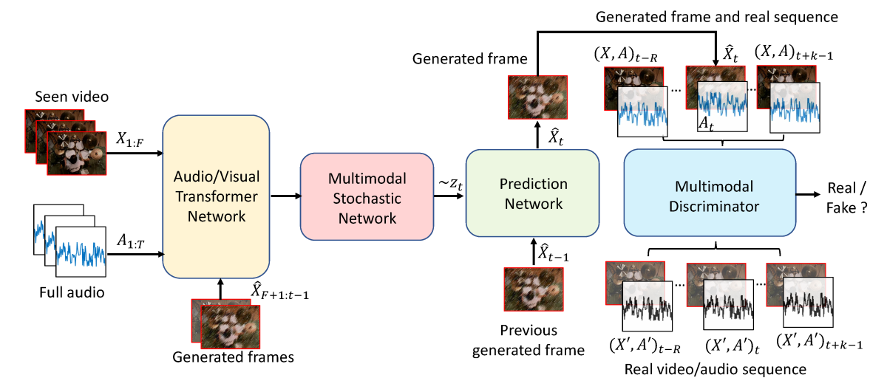

<!--
Copyright (C) 2023 Mitsubishi Electric Research Laboratories (MERL)

SPDX-License-Identifier: AGPL-3.0-or-later
-->

# Sound2Sight: Generating Visual Dynamics from Sound and Context

## Overview

Code repository for ["Sound2Sight: Generating Visual Dynamics from Sound and Context"](https://www.ecva.net/papers/eccv_2020/papers_ECCV/papers/123720698.pdf), ECCV 2020.

[[Video]](https://www.youtube.com/watch?v=i4ie5y84HhQ)

<br/>



<br/>

Learning associations across modalities is critical for robust multimodal reasoning, especially when a modality is missing. Exploiting such associations can help with occlusion reasoning, "seeing through corners", aiding the hearing impaired, etc.

In this work, we consider the task of generating future video frames given the accompanying video and the visual past. Towards this end, we propose a deep neural network with the following three components:

 * Prediction Network
 * Multimodal Stochastic Network
 * Multimodal Discriminator Network

As illustrated in the figure above, the prediction network is responsible for generating the future frames, one frame at a time. In order to do so, it samples a stochastic vector from the Stochastic Network at every time step. The stochastic network learns the distribution from which this sampling takes place. Further, a multimodal discriminator judges the realism of the generated frames besides looking into the smoothness of object motion and synchrony with the audio channel.

## Installation

Please refer to requirements.txt file.
```
pip install -r requirements.txt
```

## Datasets

In the paper, we conduct experiments on four datasets, viz. M3SO-NB, M3SO, AudioSet Drums, and YouTube Painting.

* M3SO/M3SO-NB Dataset: In this work we conduct experiments on the M3SO/M3SO-NB dataset, which incorporates sound into the existing Stochastic Moving MNIST dataset. In this repo, we provide the code for generating this dataset. In order to generate the dataset, please run:

```
$ cd M3SO_Gen_Code
```

Next, please download and copy the standard mnist dataset from http://yann.lecun.com/exdb/mnist/ and unzip it to the data/raw folder. Then run:
```
$ python multimodal_moving_mnist_with_block.py
```
Alternatively, the dataset can also be downloaded from: [M3SO Dataset](https://www.dropbox.com/s/1e17rrkoz1xfxl7/M3SO.zip?dl=0).

* AudioSet Drums Dataset: The AudioSet Drums dataset is available at this [link](https://www.dropbox.com/s/7ykgybrc8nb3lgf/AudioSet_Drums.zip?dl=0).

* YouTube Painting Dataset: The YouTube Painting dataset is available at this [link](https://www.dropbox.com/s/6n1n1zgwjpwttp4/YouTube_Painting.zip?dl=0).

## Training

In this repo, we provide the code for training and evaluating Sound2Sight on the M3SO-NB dataset.  In order to train, run:
```
$ python train_svg_lp_audio_48_stochtrans_combl2_disc_sample_prior.py --dataset smmnist --batch_size 110 --g_dim 128 --z_dim 10 --data_root $DATA_ROOT/MovingMNIST_Dataset_Generation/DTMF/data_longer/ --log_dir /path/to/log/directory --n_past 5 --n_future 15 --n_eval 25 --niter 1001
```

In order to train on the other datasets, simply change the "--dataset" flag in the "train_svg_lp_audio_48_stochtrans_combl2_disc_sample_prior.py". Also make sure to change any other parameters such as "image_width", or "--channels" as necessary.

## Evaluation

Post the training, the evaluation may be performed by running the following command:

```
$ python generate_svg_lp_stochtrans_audio_stft_48.py --batch_size 100 --data_root $DATA_ROOT/MovingMNIST_Dataset_Generation/DTMF/data_longer/ --model_path /path/to/model/file --log_dir /path/to/log/directory/where/generation/results/will/be/saved --n_past 5 --n_future 25 --model_epoch 1000 --log_path /path/to/log/directory/where/result/logs/will/be/saved --nsample 100
```

For other datasets:
We provide the deep learning model definitions for the other datasets (Audioset-Drums and Youtube-Paintings) in the models/ directory. Please follow the above steps for training our model on these datasets by replacing the model definition in train_svg_lp_audio_48_stochtrans_combl2_disc_sample_prior.py at line 153 to use those in drums_dcgan64.py or painting_dcgan64.py.


## Citation

If you use any part or all of the software, please cite the following:

```BibTeX
@inproceedings{chatterjee2020sound2sight,
    author = {Chatterjee, Moitreya and Cherian, Anoop},
    title = {Sound2Sight: Generating Visual Dynamics from Sound and Context},
    booktitle = {European Conference on Computer Vision (ECCV)},
    year = {2020},
    pages = {701--719},
    organization={Springer}
}
```

## Contact

For any queries, questions about our work or this code repository, please email: Moitreya Chatterjee (chatterjee@merl.com)

## Contributing

See [CONTRIBUTING.md](CONTRIBUTING.md) for our policy on contributions.

## License

Released under `AGPL-3.0-or-later` license, as found in the [LICENSE.md](LICENSE.md) file.

All files, except `M3SO_Gen_Code/dtmf.py`:

```
Copyright (C) 2020, 2023 Mitsubishi Electric Research Laboratories (MERL).

SPDX-License-Identifier: AGPL-3.0-or-later
```

`M3SO_Gen_Code/dtmf.py` was adapted from https://codeberg.org/ubuntourist/DTMF/src/branch/main/DTMF.py (GPL-3.0 license: see [LICENSES/GPL-3.0-or-later.md](LICENSES/GPL-3.0-or-later.md)):
```
Copyright (C) 2020, 2023 Mitsubishi Electric Research Laboratories (MERL)
Copyright (C) 2003 Jiwon Hahn

SPDX-License-Identifier: AGPL-3.0-or-later
SPDX-License-Identifier: GPL-3.0-or-later
```
